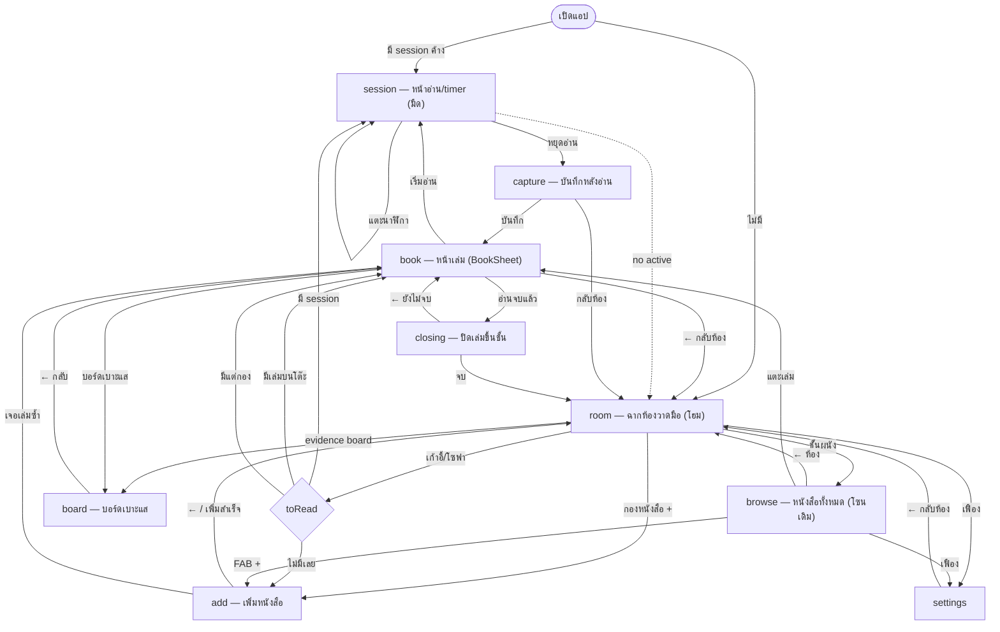

# คั่น — แผนที่การนำทาง (จากโค้ดจริง)

> ดึงจากทุก `go()` / `startSession` / `clearSession` ในโค้ด ณ commit ปัจจุบัน
> หน้าจอทั้งหมด (screen): `room` `browse` `book` `add` `session` `capture` `closing` `board` `settings`

## แผนภาพรวม

## ตารางแตะ → ไปไหน (ละเอียด)

### room (HomeScene — โฮม)
| แตะ | ไป | เงื่อนไข |
|---|---|---|
| กองหนังสือ (ปุ่ม +) | `add` | — |
| ชั้นหนังสือผนัง | `browse` | — |
| เก้าอี้/โซฟา | `session` / `book` / `add` | มี session→session · มีเล่มบนโต๊ะ(หรือกอง)→book · ว่างเปล่า→add |
| evidence board บนผนัง | `board` / `browse` | มีเล่มบนโต๊ะ(หรือเล่มแรก)→board · ไม่มี→browse |
| เฟือง (มุมขวาบน) | `settings` | — |

### browse (Room — หนังสือทั้งหมด)
| แตะ | ไป |
|---|---|
| ← ห้อง | `room` |
| เล่มใดก็ได้ (สัน/วางราบ/กาง/กอง) | `book` |
| FAB + | `add` |
| เฟือง | `settings` |

### book (BookSheet — หน้าเล่ม)
| แตะ | ไป | หมายเหตุ |
|---|---|---|
| ← กลับห้อง | `room` | |
| เริ่มอ่าน | `session` | `startSession()` เริ่ม session ใหม่ |
| อ่านจบแล้ว | `closing` | |
| บอร์ดเบาะแส | `board` | |
| (โต๊ะ/กอง/อ่านซ้ำ) | อยู่ที่ `book` | เปลี่ยน status + refresh |

### add (AddBook)
| แตะ | ไป |
|---|---|
| ← กลับห้อง / เพิ่มสำเร็จ | `room` |
| การ์ด "เจอเล่มซ้ำ → ไปที่เล่ม" | `book` |

### session (SessionScreen — หน้าอ่าน)
| แตะ | ผล |
|---|---|
| นาฬิกา | พัก/เดินต่อ (อยู่หน้าเดิม) |
| หยุดอ่าน | `capture` |
| ลูกศร/ลากพาเนล | เปิดบอร์ดข้าง timer (ไม่เปลี่ยนหน้า) · เต็มจอ=พักอัตโนมัติ |
| (ไม่มี session) กลับห้อง | `room` |

### capture (บันทึกหลังอ่าน)
| แตะ | ไป |
|---|---|
| บันทึก/เสร็จ | `book` (`clearSession()`) |
| กลับห้อง | `room` |

### closing (ปิดเล่มขึ้นชั้น)
| แตะ | ไป |
|---|---|
| ← ยังไม่จบ | `book` |
| จบ (ขึ้นชั้น) | `room` |

### board (บอร์ดเบาะแส)
| แตะ | ไป | หมายเหตุ |
|---|---|---|
| ← กลับ | `book` | โหมด route (เข้าจากหน้าเล่ม) |
| — | — | โหมดพาเนล (เข้าจาก session) ไม่ใช่การเปลี่ยนหน้า |

### settings
| แตะ | ไป |
|---|---|
| ← กลับห้อง | `room` |

## หมายเหตุ flow สำคัญ
- **เปิดแอปแล้วมี session ค้าง** (ปิดแท็บกลางคัน) → เด้งเข้า `session` อัตโนมัติ (App.tsx)
- **วงจรอ่านครบ:** room/book → `session` → หยุด → `capture` → `book` → (อยากจบ) → `closing` → ขึ้นชั้น → room
- **`browse` คือ Room เดิม** (โซนชั้น/โต๊ะ/กอง) เข้าจาก "ชั้นผนัง" ในฉากโฮม — เป็นมุมมองรายละเอียดสำหรับเลือกเล่ม
